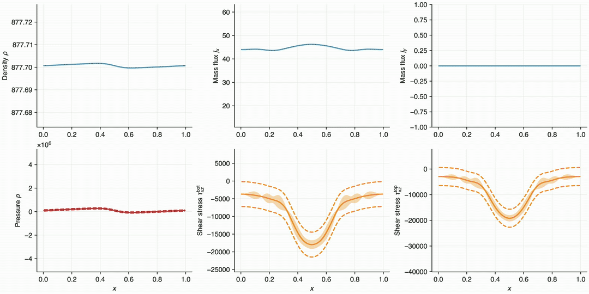

[](https://pypi.org/project/GaPFlow/)
[](https://github.com/hannes-holey/GaPFlow/actions/workflows/ci.yaml)
[](https://github.com/hannes-holey/GaPFlow/actions/workflows/ci.yaml)

# GaPFlow
*Gap-averaged flow simulations with Gaussian Process regression.*

This code implements the solution of time-dependent lubrication problems as described in:
- [Holey, H. et al., Tribology Letters 70 (2022)](https://doi.org/10.1007/s11249-022-01576-5)

The extension to atomistic-continuum multiscale simulations with Gaussian process (GP) surrogate models has been described in:
- [Holey, H. et al., Science Advances 11, eadx4546 (2025)](https://doi.org/10.1126/sciadv.adx4546)

The code uses [µGrid](https://muspectre.github.io/muGrid/) for handling macroscale fields and [tinygp](https://tinygp.readthedocs.io/en/stable/index.html) as GP library. Molecular dynamics (MD) simulations run with [LAMMPS](https://docs.lammps.org) through its [Python interface](https://docs.lammps.org/Python_head.html). Elastic deformation is computed using [ContactMechanics](https://contactengineering.github.io/ContactMechanics/).

## Installation

A minimal version can be installed via
```
pip install GaPFlow
```
The published wheels are currently not built with LAMMPS.
Thus, running multiscale simulations with molecular dynamics is not possible with this quick installation.
For the full functionality it is required to build `GaPFlow` from source.

### Building from source

When building from source follow these steps:

0. Make sure you have MPI installed, e.g. on Debian-based systems `openmpi-bin` and `libopenmpi-dev` should be installed on your system.

1. The multiscale framework depends on LAMMPS which is contained as a Git submodule in this repository. After cloning the repository initialize the submodule with
```
git submodule update --init
```
2. Install LAMMPS and mpi4py. We provide a script to build LAMMPS via `cmake` and install the Python package in your local environment. 
```
bash install_lammps.sh
```
Alternatively, follow the equivalent steps in the LAMMPS documentation with a complete list of build options. Make sure that you have the optional LAMMPS packages `MANYBODY`, `MOLECULES` and `ÈXTRA-FIX` installed. To make sure that everything is correctly installed run `python .check_lammps.py`. The last three lines should look similar to these:
```
MPI:  True
mpi4py:  True
Installed packages: ['EXTRA-FIX', 'MANYBODY', 'MOLECULE']
```
3. Build [µGrid](https://muspectre.github.io/muGrid/GettingStarted.html)'s Python bindings
```
pip install -v --force-reinstall --no-cache --no-binary muGrid muGrid
```
and make sure MPI and PnetCDF get detected. For manual installations of PnetCDF (recommended), you may need to tell `pkg_config` where to find it, e.g.
```
export PKG_CONFIG_PATH=$HOME/.local/lib/pkgconfig:$HOME/.local/lib64/pkgconfig:$PKG_CONFIG_PATH
```
for instalations under `$HOME/.local/`.

4. Finally, install the package with its remaining dependencies and testing capabilities
```
pip install -e .[test]
```

5. Make sure that everything works by running the tests with `pytest`.

## Minimal example
Simulation inputs are commonly provided in YAML files. A typical input file might look like this:

```yaml
# examples/journal.yaml
options:
    output: data/journal
    write_freq: 10
grid:
    dx: 1.e-5
    dy: 1.
    Nx: 100
    Ny: 1
    xE: ['D', 'N', 'N']
    xW: ['D', 'N', 'N']
    yS: ['P', 'P', 'P']
    yN: ['P', 'P', 'P']
    xE_D: 877.7007
    xW_D: 877.7007
geometry:
    type: journal
    CR: 1.e-2
    eps: 0.7
    U: 0.1
    V: 0.
numerics:
    tol: 1e-9
    dt: 1e-10
    max_it: 200
properties:
    shear: 0.0794
    bulk: 0.
    EOS: DH
    P0: 101325
    rho0: 877.7007
    T0: 323.15
    C1: 3.5e10
    C2: 1.23
```

Note that this example uses fixed-form constitutive laws without GP surrogate models or MD data. More example input files can be found in the [examples](examples/) directory.

The input files can be used to start a simulation from the command line
```bash
python -m GaPFlow -i my_input_file.yaml
```
or from a Python script
```python
from GaPFlow.problem import Problem

myProblem = Problem.from_yaml('my_input_file.yaml')
myProblem.pre_run()
myProblem.run()
```
Simulation output is stored under the location specified in the input file. After successful completion, you should find the following files.
- `config.yml`: A sanitized version of your simulation input.
- `topo.nc`: NetCDF file containing the gap height and gradients.
- `sol.nc`: NetCDF file containing the solution and stress fields.
- `history.csv`: Contains the time series of scalar quantities (step, Ekin, residual, ...)
- `gp_[xz,yz,zz].csv` (Optional): Contains the time series of GP hyperparameters, database size, etc.
- `Xtrain.npy` (Optional): Training data inputs
- `Ytrain.npy` (Optional): Training data observations
- `Ytrain_err.npy` (Optional): Training data observation error

The code comes with a few handy [command line tools](GaPFlow/cli/) for visualizations like this one



which shows the transient solution of a 1D journal bearing with active learning of the constitutive behavior. 

## Funding
This work received funding from the German Research Foundation (DFG) through GRK 2450 and from the Alexander von Humboldt Foundation through a Feodor Lynen Fellowship.
